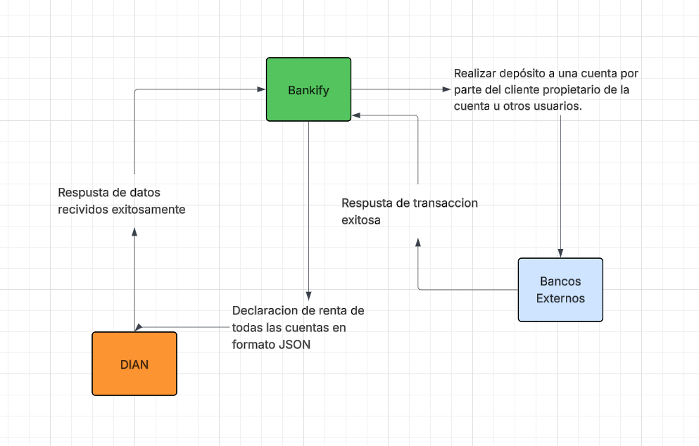

# 📄 Requerimientos del Sistema

## 1. Sistema

* **Nombre del sistema:** Bankify.
* **Objetivo:** El sistema tiene como objetivo garantizar que las cuentas creadas cumplan reglas específicas del negocio y que los clientes puedan interactuar con ellas de forma sencilla y segura.

## 2. Problema a resolver
Actualmente, Bankify no cuenta con un sistema centralizado que permita registrar cuentas bancarias de manera validada, consultar saldos, realizar depósitos controlados, ni generar reportes tributarios en formato PDF para clientes o JSON para la DIAN.

## 3. Diagrama de Contexto

### 3.1 Diagrama

### 3.2 Actores

| Actor / Rol | Descripción |
| :--- | :--- |
| Cliente | Usuario final propietario de la cuenta que consulta saldos, realiza depósitos e inactiva sus propias cuentas. |
| Asesor | Rol encargado de la gestión completa (crear, activar, inactivar y actualizar) de las cuentas bancarias. |
| Supervisor | Rol autorizado para gestionar el módulo de clientes (crear, activar, inactivar y actualizar información). |
| Gerente Financiero | Responsable de generar el reporte tributario consolidado para la DIAN. |
| Otros Usuarios | Terceros autorizados para realizar depósitos a cuentas de las cuales no son propietarios. |

### 3.3 Sistemas externos

| Sistema | Descripción |
| :--- | :--- |
| DIAN | Entidad gubernamental receptora de reportes tributarios de declaración de renta en formato JSON. |
| Bancos Registrados | Entidades externas (ej. Bancolombia, Davivienda) bajo las cuales se validan los números de cuenta según sus dos primeros dígitos. |

## 4. Alcance del sistema

### 4.1 Dentro del sistema

* **Autenticación segura:** Validación de acceso mediante usuario y contraseña para operadores y clientes.
* **Gestión de Cuentas:** Registro de números de 10 dígitos numéricos asociados a bancos válidos en el sistema.
* **Operaciones Transaccionales:** Funcionalidad para realizar depósitos controlados y consultar saldos en tiempo real.
* **Reportes Tributarios:** Generación automática de documentos de declaración de renta en PDF (clientes) y JSON (DIAN).

### 4.2 Fuera del sistema

* **Servicios financieros complejos:** No se contempla en esta versión inicial el escalamiento a servicios o productos bancarios avanzados.
* **Gestión de entidades bancarias:** El sistema valida la pertenencia a un banco, pero no administra la infraestructura de los bancos externos.
* **Transacciones interbancarias directas:** El alcance se limita a depósitos y gestión interna sin mencionar transferencias hacia otros sistemas bancarios externos.